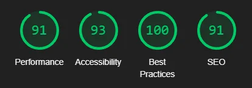

# Cozy Café Website

## Overview

The **Cozy Café Website** is a responsive and modern website designed for a fictional café. The project demonstrates reusable components like a **navbar** and **footer** for easy maintainability across multiple pages. The site is built with HTML, CSS, Bootstrap, and JavaScript.

## Features

- **Responsive Design:** Optimized for mobile, tablet, and desktop views.
- **Reusable Components:**
  - Navbar and footer are dynamically loaded from external files using JavaScript.
- **Bootstrap Integration:** Utilizes Bootstrap for responsive layout and consistent styling.

## Project Structure

```
README.md                 # Project documentation
src/
├── index.html            # Home page
├── menu.html             # Menu page
├── contact.html          # Contact page
├── navbar.html           # Navbar template
├── footer.html           # Footer template
├── js/
│   ├── navbar.js         # Script to load the navbar dynamically
│   ├── footer.js         # Script to load the footer dynamically
│   └── script.js         # Miscellaneous functionality (e.g., collapsing navbar)
├── css/
│   ├── style.css         # Custom styles
└── assets/               # Images and icons
```

## Libraries and Frameworks

- [Bootstrap 5.3](https://getbootstrap.com/): For responsive layout and UI components.
- [Boxicons](https://boxicons.com/): For icons.
- [Google Fonts](https://fonts.google.com/): For typography.

## Lighthouse Performance Report

A Lighthouse performance report evaluates the website's quality in terms of performance, accessibility, best practices, and SEO. This ensures that the website adheres to modern standards and delivers an optimal user experience.



### Why This is Important:

- **Performance:** Ensures fast loading times, which improves user engagement and reduces bounce rates.
- **Accessibility:** Guarantees that the website is usable by people with disabilities.
- **Best Practices:** Confirms the implementation of modern development techniques.
- **SEO:** Enhances visibility in search engine results, driving more traffic to the site.

## Acknowledgments

- **Bootstrap Team:** For their powerful CSS framework.
- **Boxicons:** For the free and elegant icons.
- **Unsplash/Pexels:** Placeholder images for demonstration purposes.

## Future Improvements

1. **More Reusable Elements**:
   - Convert menu cards on the `menu.html` page into reusable components for easier management and scalability.
   - Apply a similar approach to the review section for creating consistent and reusable card layouts.
2. **Navbar Enhancements**:
   - Modify the collapsible navbar toggler to display an "X" icon when the menu is expanded, enhancing usability and aesthetics.

## License

This project is open-source and free to use for educational or personal purposes.
